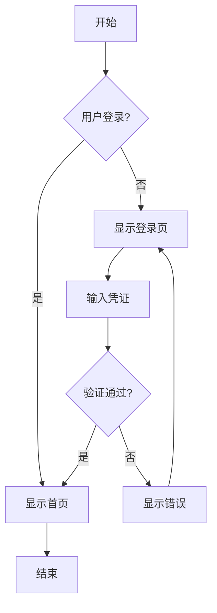
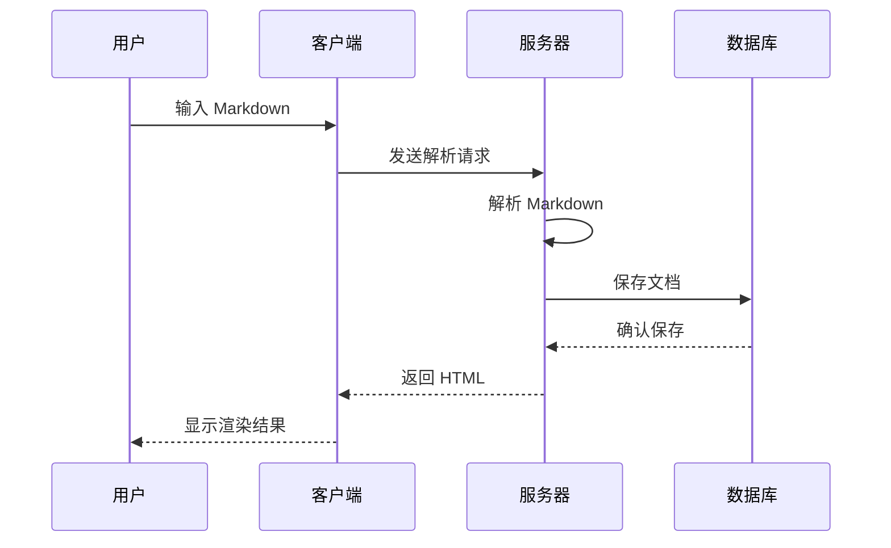
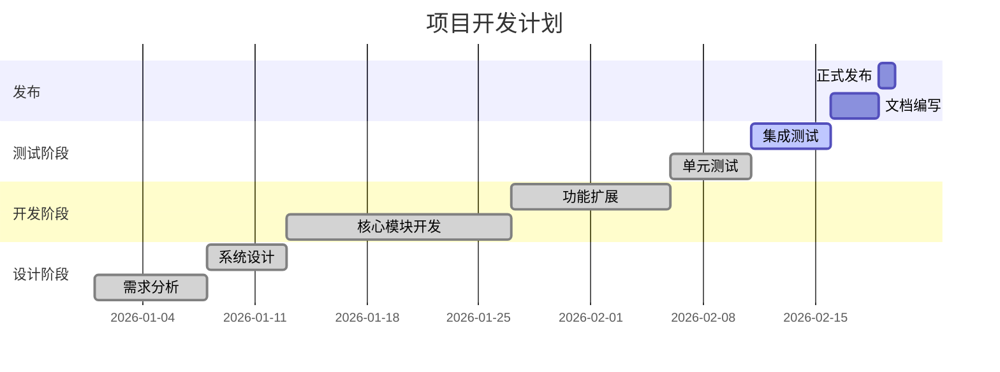
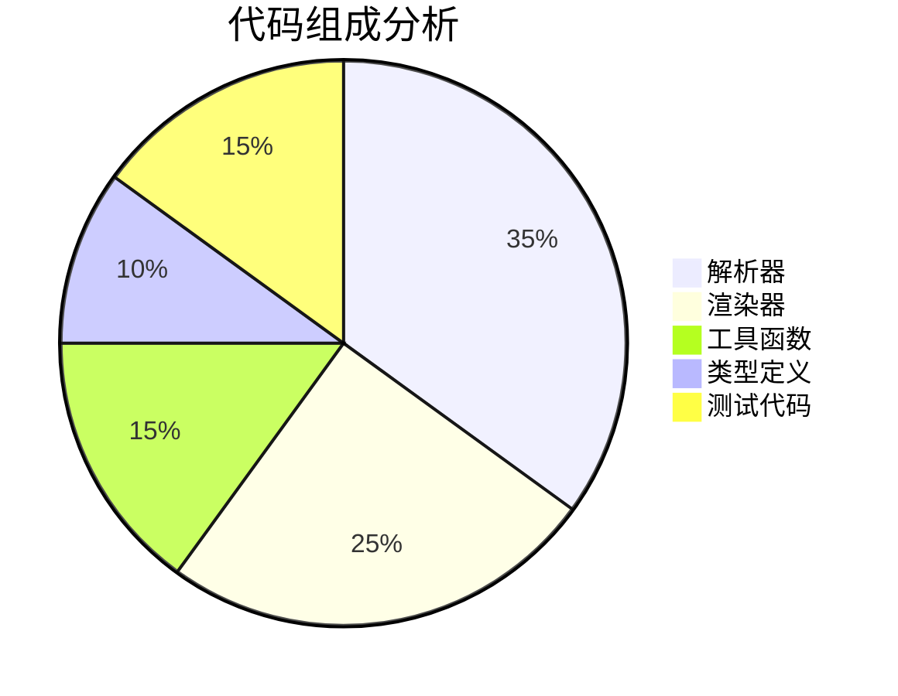
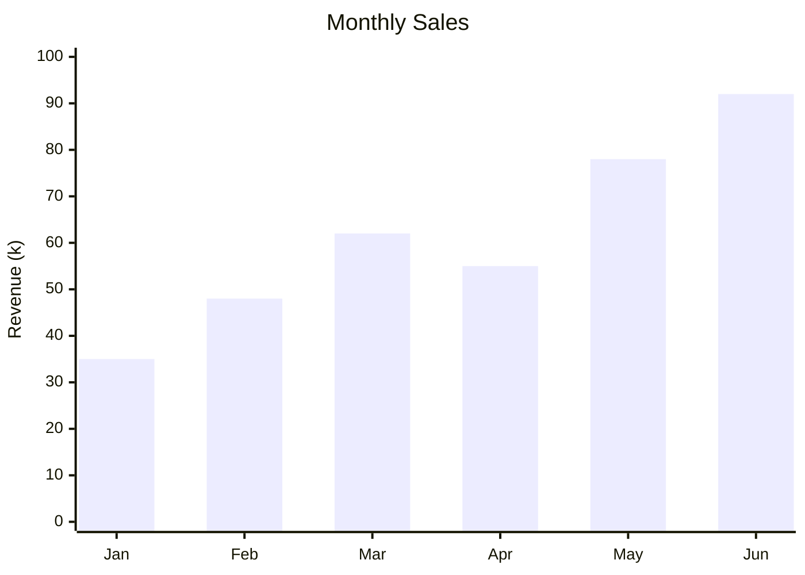
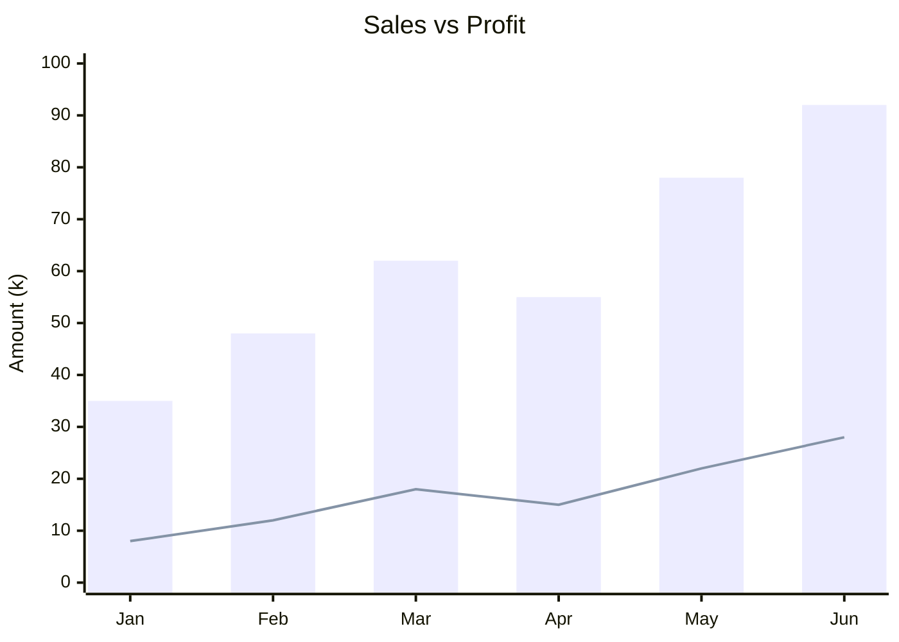

# Markdown 完整语法演示

欢迎阅读本文档！这是一份全面展示 `@dreamer/markdown` 库解析能力的测试文档。无论你是 Markdown 新手还是资深用户，这份文档都将帮助你了解我们支持的所有语法特性。

本库采用纯 TypeScript 实现，零依赖，支持 **Deno**、**Bun** 和浏览器环境，是构建文档系统、博客平台、知识库的理想选择。

---

## 基础语法

Markdown 的设计哲学是让写作者专注于内容本身，而非格式。下面让我们从最基础的语法开始。

### 标题层级

在 Markdown 中，使用 `#` 符号来表示标题。一个 `#` 表示一级标题，两个 `##` 表示二级标题，以此类推，最多支持六级标题。

#### 四级标题示例

这是四级标题下的内容。四级标题通常用于较为细分的章节。

##### 五级标题示例

五级标题在文档中使用较少，但在需要精细划分内容时非常有用。

###### 六级标题示例

六级标题是最小的标题级别，适用于非常细节的分类。

---

## 文本格式化

文本格式化是 Markdown 的核心功能之一。通过简单的符号，你可以为文本添加各种样式。

### 基础格式

在日常写作中，我们经常需要强调某些内容。Markdown 提供了多种方式：

- 这是 **粗体文本**，用于强调重要内容
- 这是 *斜体文本*，用于表示术语或引用
- 这是 ***粗斜体***，需要特别强调时使用
- 这是 ~~删除线文本~~，表示已过时或需要删除的内容
- 这是 `行内代码`，用于表示代码片段、命令或技术术语

### 组合使用

你可以在同一段落中组合使用多种格式。例如：

> 在软件开发中，**代码质量**和 *可维护性* 是至关重要的。我们应该避免 ~~临时解决方案~~，而是采用 `最佳实践` 来构建健壮的系统。

---

## 链接与图片

链接和图片是文档中不可或缺的元素，它们让内容更加丰富和互联。

### 链接类型

Markdown 支持多种链接方式：

1. **内联链接**：[访问 GitHub](https://github.com) 是最常用的方式
2. **带标题的链接**：[Deno 官网](https://deno.land "一个安全的 JavaScript/TypeScript 运行时") 鼠标悬停可见标题
3. **自动链接**：直接输入 URL 会自动识别 https://jsr.io
4. **邮箱链接**：联系我们 contact@example.com

### 图片展示

图片让文档更加生动。下面展示本地图片的使用方式：

#### 风景摄影


上图展示了清晨时分的山间景色，晨雾缭绕，宛如仙境。摄影作品往往能够捕捉到大自然最美的瞬间。

#### 多图排列

有时候我们需要并排展示多张图片，可以使用表格布局：

| 图片一 | 图片二 | 图片三 |
|:------:|:------:|:------:|
|  |  |  |
| *山间小路* | *林间溪流* | *夕阳余晖* |

#### 图片画廊


这些图片展示了大自然的多样之美，从壮阔的山川到细腻的花草，每一处都值得我们驻足欣赏。

---

## 列表详解

列表是组织信息的有效方式，Markdown 支持多种列表类型。

### 无序列表

无序列表用于表示没有特定顺序的项目集合：

- **前端技术栈**
  - React - 用户界面库
  - Vue - 渐进式框架
  - Svelte - 编译型框架
- **后端技术栈**
  - Node.js - JavaScript 运行时
  - Deno - 安全的 TypeScript 运行时
  - Bun - 高性能 JavaScript 运行时
- **数据库**
  - PostgreSQL - 关系型数据库
  - MongoDB - 文档数据库
  - Redis - 键值存储

### 有序列表

有序列表适用于有步骤或优先级的内容：

1. **项目规划阶段**
   1. 需求分析与调研
   2. 技术方案设计
   3. 资源评估与分配
2. **开发阶段**
   1. 环境搭建
   2. 核心功能开发
   3. 单元测试编写
3. **发布阶段**
   1. 集成测试
   2. 文档编写
   3. 版本发布

### 任务列表

任务列表非常适合追踪项目进度：

- [x] 完成项目初始化
- [x] 实现核心解析器
- [x] 添加 GFM 表格支持
- [x] 实现表格增强功能（排序、搜索、合并）
- [x] 编写单元测试（538 个测试通过）
- [x] 完善 API 文档
- [ ] 添加更多语法高亮主题
- [ ] 实现实时预览编辑器
- [ ] 发布 1.0 正式版

---

## 引用块

引用块用于引述他人的话语或强调重要信息。

### 名人名言

> 代码是写给人看的，顺便能在机器上运行。
>
> — **Donald Knuth**，计算机科学家

> 简单是可靠的先决条件。
>
> — **Edsger W. Dijkstra**

### 嵌套引用

引用可以嵌套使用，表示对话或多层引述：

> 关于软件开发的讨论：
>
> > 我们应该优先考虑代码的可读性还是性能？
> >
> > > 在大多数情况下，可读性更重要。过早优化是万恶之源。
> > >
> > > — Donald Knuth

### 引用中的格式

引用块内可以包含其他 Markdown 元素：

> **关于 Markdown 的优势：**
>
> 1. 语法简洁，学习曲线平缓
> 2. 纯文本格式，版本控制友好
> 3. 可转换为多种输出格式
>
> ```javascript
> // 示例：使用 @dreamer/markdown
> import { render } from "@dreamer/markdown";
> const result = render("# Hello World");
> ```

---

## 代码展示

代码块是技术文档的核心组成部分。我们的库支持多种编程语言的语法展示。

### TypeScript 示例

```typescript
/**
 * Markdown 渲染器配置接口
 */
interface MarkdownOptions {
  /** 是否启用 GFM 扩展 */
  gfm?: boolean;
  /** 是否解析数学公式 */
  math?: boolean;
  /** 是否启用表格增强 */
  tableEnhance?: boolean;
  /** 自定义代码高亮函数 */
  highlight?: (code: string, lang: string) => string;
}

/**
 * 渲染 Markdown 文档
 * @param content - Markdown 内容
 * @param options - 渲染选项
 * @returns 渲染结果
 */
function render(content: string, options?: MarkdownOptions): MarkdownResult {
  const opts = { gfm: true, math: true, ...options };
  // 解析逻辑...
  return { html: "", frontMatter: {}, toc: [] };
}
```

### Python 数据处理

```python
import pandas as pd
import matplotlib.pyplot as plt

def analyze_data(filepath: str) -> dict:
    """
    分析数据文件并生成统计报告

    Args:
        filepath: 数据文件路径

    Returns:
        包含统计信息的字典
    """
    # 读取数据
    df = pd.read_csv(filepath)

    # 基础统计
    stats = {
        'total_rows': len(df),
        'columns': list(df.columns),
        'missing_values': df.isnull().sum().to_dict(),
        'summary': df.describe().to_dict()
    }

    # 生成可视化
    plt.figure(figsize=(10, 6))
    df.plot(kind='bar')
    plt.title('数据分析结果')
    plt.savefig('analysis.png')

    return stats
```

### SQL 查询示例

```sql
-- 查询活跃用户及其订单统计
SELECT
    u.id,
    u.username,
    u.email,
    COUNT(o.id) as order_count,
    SUM(o.amount) as total_amount,
    AVG(o.amount) as avg_amount
FROM users u
LEFT JOIN orders o ON u.id = o.user_id
WHERE u.status = 'active'
    AND o.created_at >= DATE_SUB(NOW(), INTERVAL 30 DAY)
GROUP BY u.id, u.username, u.email
HAVING order_count > 5
ORDER BY total_amount DESC
LIMIT 100;
```

### Shell 脚本

```bash
#!/bin/bash

# 项目部署脚本
set -e

echo "🚀 开始部署..."

# 拉取最新代码
git pull origin main

# 安装依赖
echo "📦 安装依赖..."
deno cache --reload src/mod.ts

# 运行测试
echo "🧪 运行测试..."
deno test --allow-all

# 构建项目
echo "🔨 构建项目..."
deno task build

# 重启服务
echo "🔄 重启服务..."
systemctl restart my-app

echo "✅ 部署完成！"
```

### JSON 配置

```json
{
  "name": "@dreamer/markdown",
  "version": "1.0.0",
  "description": "功能丰富的 Markdown 解析库",
  "exports": {
    ".": "./src/mod.ts",
    "./table": "./src/table.ts",
    "./theme": "./src/theme.ts"
  },
  "tasks": {
    "test": "deno test --allow-all",
    "check": "deno check src/mod.ts",
    "lint": "deno lint"
  },
  "compilerOptions": {
    "strict": true,
    "noImplicitAny": true
  }
}
```

---

## 表格功能

表格是展示结构化数据的最佳方式。我们的库提供了强大的表格增强功能。

### 基础数据表

| 功能模块 | 状态 | 测试覆盖 | 说明 |
|:---------|:----:|:--------:|:-----|
| 基础语法解析 | ✅ | 100% | 标题、段落、列表、链接等 |
| GFM 扩展 | ✅ | 100% | 表格、任务列表、自动链接 |
| 数学公式 | ✅ | 100% | LaTeX 行内和块级公式 |
| 代码高亮 | ✅ | 100% | 支持自定义高亮函数 |
| 表格增强 | ✅ | 100% | 排序、搜索、单元格合并 |
| 自定义容器 | ✅ | 100% | tip/warning/danger 等 |
| 主题系统 | ✅ | 100% | 亮色/暗色主题切换 |

### 性能对比

| 运行时 | 解析速度 | 内存占用 | 启动时间 | 综合评分 |
|:------:|:--------:|:--------:|:--------:|:--------:|
| Deno | 95ms | 12MB | 150ms | ⭐⭐⭐⭐⭐ |
| Bun | 82ms | 10MB | 80ms | ⭐⭐⭐⭐⭐ |
| Node | 120ms | 18MB | 200ms | ⭐⭐⭐⭐ |

### API 参考表

| 函数 | 参数 | 返回值 | 描述 |
|:-----|:-----|:-------|:-----|
| `render()` | `content: string, options?: Options` | `MarkdownResult` | 完整渲染，包含 HTML、Front Matter、TOC |
| `parse()` | `content: string, options?: Options` | `string` | 仅解析为 HTML |
| `parseFrontMatter()` | `content: string` | `{ frontMatter, body }` | 解析 YAML 头部 |
| `extractToc()` | `html: string` | `TocItem[]` | 从 HTML 提取目录 |
| `createTable()` | `headers, rows, options` | `string` | 从数组创建表格 |

### 可排序表格

使用 `<!-- table: sortable -->` 注释启用列排序功能，点击表头可以升序/降序排列：

<!-- table: sortable, caption="员工信息表（点击表头排序）" -->
| 姓名 | 部门 | 工龄 | 绩效评分 |
|:-----|:----:|:----:|:--------:|
| 张三 | 技术部 | 5 | 92 |
| 李四 | 市场部 | 3 | 88 |
| 王五 | 技术部 | 8 | 95 |
| 赵六 | 人事部 | 2 | 85 |
| 钱七 | 技术部 | 6 | 90 |
| 孙八 | 市场部 | 4 | 87 |

### 可搜索表格

使用 `<!-- table: searchable -->` 注释启用搜索过滤功能：

<!-- table: searchable, caption="产品列表（输入关键词搜索）" -->
| 产品名称 | 类别 | 价格 | 库存 | 状态 |
|:---------|:----:|-----:|:----:|:----:|
| MacBook Pro | 电脑 | 12999 | 50 | 在售 |
| iPhone 15 | 手机 | 6999 | 200 | 在售 |
| iPad Air | 平板 | 4599 | 80 | 在售 |
| AirPods Pro | 耳机 | 1899 | 150 | 在售 |
| Apple Watch | 手表 | 2999 | 60 | 预售 |
| Mac Mini | 电脑 | 4499 | 30 | 在售 |
| HomePod | 音箱 | 2299 | 0 | 缺货 |

### 单元格合并

支持横向合并（colspan）和纵向合并（rowspan）：

- `||` 或 `>` - 向左合并（横向）
- `^^` 或 `^` - 向上合并（纵向）

| 季度 | 部门 | Q1 销售额 | Q2 销售额 | Q3 销售额 | Q4 销售额 |
|:----:|:----:|:---------:|:---------:|:---------:|:---------:|
| 2024 || 技术部 | 120万 | 150万 | 180万 | 200万 |
| ^^ | 市场部 | 80万 | 95万 | 110万 | 130万 |
| ^^ | 运营部 | 60万 | 70万 | 85万 | 100万 |
| 2025 || 技术部 | 180万 | 210万 | ^^ | ^^ |
| ^^ | 市场部 | 100万 | 120万 | ^^ | ^^ |

### 组合功能表格

可以同时启用多个功能：

<!-- table: sortable, searchable, caption="综合示例（排序 + 搜索）" -->
| 编号 | 项目名称 | 负责人 | 进度 | 优先级 | 截止日期 |
|:----:|:---------|:------:|:----:|:------:|:--------:|
| P001 | 用户系统重构 | 张三 | 85% | 高 | 2026-02-15 |
| P002 | 移动端适配 | 李四 | 60% | 中 | 2026-03-01 |
| P003 | 性能优化 | 王五 | 100% | 高 | 2026-01-31 |
| P004 | 文档完善 | 赵六 | 40% | 低 | 2026-03-15 |
| P005 | API 重设计 | 钱七 | 20% | 高 | 2026-04-01 |
| P006 | 单元测试 | 孙八 | 90% | 中 | 2026-02-28 |

---

## 高级语法特性

除了基础语法，我们还支持许多高级特性，让你的文档更加丰富。

### 上标与下标

科学公式和化学符号经常需要上标和下标：

- **数学公式**：爱因斯坦质能方程 E = mc^2^
- **化学分子式**：水 H~2~O、二氧化碳 CO~2~、葡萄糖 C~6~H~12~O~6~
- **物理单位**：面积 m^2^、体积 m^3^、加速度 m/s^2^
- **数学表达式**：x^2^ + y^2^ = r^2^（圆的方程）

### 高亮与标记

当你需要突出显示某些内容时，可以使用高亮：

在这段代码中，==最关键的部分== 是数据验证逻辑。请特别注意 ==第 42 行== 的边界条件处理。

我们的目标是实现 ==零依赖==、==高性能==、==跨平台== 的 Markdown 解析器。

### 插入与删除

文档修订时，标记新增和删除的内容非常有用：

- 价格：~~原价 ¥199~~ → ++现价 ¥99++
- 功能：~~已移除旧版 API~~ → ++新增 TypeScript 类型支持++
- 版本：~~v0.9.0~~ → ++v1.0.0 正式版++

### 键盘按键

编写操作指南时，键盘按键符号让指令更清晰：

常用快捷键：
- 保存文件：[[Ctrl]] + [[S]]（Mac: [[Cmd]] + [[S]]）
- 撤销操作：[[Ctrl]] + [[Z]]
- 全选内容：[[Ctrl]] + [[A]]
- 查找替换：[[Ctrl]] + [[H]]
- 打开命令面板：[[Ctrl]] + [[Shift]] + [[P]]

特殊按键：[[Enter]] [[Tab]] [[Esc]] [[Backspace]] [[Delete]] [[Space]]

方向键：[[↑]] [[↓]] [[←]] [[→]]

---

## Emoji 表情

Emoji 让文档更加生动有趣！我们支持 300+ 常用 emoji 简码：

### 表情符号

:smile: 微笑 | :laughing: 大笑 | :wink: 眨眼 | :heart_eyes: 爱心眼 | :thinking: 思考

:cry: 哭泣 | :angry: 生气 | :fearful: 害怕 | :sleeping: 睡觉 | :sunglasses: 墨镜

### 手势符号

:+1: 点赞 | :-1: 踩 | :clap: 鼓掌 | :wave: 挥手 | :pray: 祈祷 | :muscle: 肌肉

### 物品符号

:rocket: 火箭 | :star: 星星 | :fire: 火焰 | :bulb: 灯泡 | :book: 书本

:computer: 电脑 | :iphone: 手机 | :email: 邮件 | :calendar: 日历 | :clock1: 时钟

### 状态标记

:white_check_mark: 完成 | :x: 失败 | :warning: 警告 | :question: 疑问 | :exclamation: 重要

:construction: 施工中 | :bug: Bug | :sparkles: 新功能 | :zap: 性能优化 | :memo: 文档

---

## 脚注说明

脚注用于添加补充说明或引用来源，不打断正文阅读流程。

Markdown 最初由 John Gruber 于 2004 年创建[^1]，其设计目标是让文档在源码形式下也具有良好的可读性[^2]。

如今，Markdown 已经成为技术文档的事实标准，被广泛应用于 GitHub[^github]、Stack Overflow、各类博客平台等。

我们的 `@dreamer/markdown` 库在标准 Markdown 基础上进行了大量扩展[^3]，支持 GFM、数学公式、自定义容器等高级特性。

[^1]: John Gruber, "Markdown", Daring Fireball, 2004年3月19日。
[^2]: Markdown 的哲学是"易读易写"（easy-to-read and easy-to-write）。
[^github]: GitHub 于 2009 年开始支持 Markdown，后发展出 GitHub Flavored Markdown (GFM)。
[^3]: 完整支持 45+ 种扩展语法，详见 README 文档。

---

## 数学公式

对于学术论文、技术文档，数学公式支持必不可少。我们使用 LaTeX 语法。

### 行内公式

勾股定理告诉我们：在直角三角形中，$a^2 + b^2 = c^2$。

圆的面积公式 $A = \pi r^2$，周长公式 $C = 2\pi r$。

求导公式：$(x^n)' = nx^{n-1}$，积分公式：$\int x^n dx = \frac{x^{n+1}}{n+1} + C$。

欧拉公式 $e^{i\pi} + 1 = 0$ 被誉为数学中最美丽的公式。

### 块级公式

高斯积分（概率论基础）：

$$
\int_{-\infty}^{\infty} e^{-x^2} dx = \sqrt{\pi}
$$

求和公式：

$$
\sum_{i=1}^{n} i = \frac{n(n+1)}{2}
$$

矩阵表示：

$$
A = \begin{pmatrix}
a_{11} & a_{12} & a_{13} \\
a_{21} & a_{22} & a_{23} \\
a_{31} & a_{32} & a_{33}
\end{pmatrix}
$$

二次方程求根公式：

$$
x = \frac{-b \pm \sqrt{b^2 - 4ac}}{2a}
$$

---

## 定义列表

定义列表适合用于术语解释、词汇表等场景。

Markdown
: 一种轻量级标记语言，由 John Gruber 于 2004 年创建。
: 设计目标是让源文件具有良好的可读性。

GFM (GitHub Flavored Markdown)
: GitHub 扩展的 Markdown 方言。
: 增加了表格、任务列表、自动链接、删除线等特性。

Front Matter
: 文档开头的 YAML 格式元数据块。
: 通常包含标题、作者、日期、标签等信息。

AST (Abstract Syntax Tree)
: 抽象语法树，代码的树状结构表示。
: Markdown 解析器通常会先将源文本转换为 AST，再生成 HTML。

---

## 缩写定义

当文档中频繁使用缩写时，可以定义缩写的完整含义。鼠标悬停在缩写上可看到完整解释。

本项目使用 HTML 和 CSS 技术构建用户界面，通过 API 与后端服务通信。所有资源通过 URL 进行访问，数据交换使用 JSON 格式。

项目托管在 JSR 上，支持在 Deno 和 Bun 等现代 JS 运行时中使用。源代码遵循 MIT 许可证。

*[HTML]: HyperText Markup Language - 超文本标记语言
*[CSS]: Cascading Style Sheets - 层叠样式表
*[API]: Application Programming Interface - 应用程序接口
*[URL]: Uniform Resource Locator - 统一资源定位符
*[JSON]: JavaScript Object Notation - JavaScript 对象表示法
*[JSR]: JavaScript Registry - JavaScript 包注册中心
*[MIT]: Massachusetts Institute of Technology - 麻省理工学院许可证

---

## 自定义容器

自定义容器用于突出显示不同类型的信息，增强文档的可读性。

:::tip 小贴士
使用 `@dreamer/markdown` 库时，建议启用所有默认选项以获得最佳体验。大多数选项默认已开启，你只需要关注需要自定义的部分。
:::

:::info 信息
本库完全使用 TypeScript 编写，提供完整的类型定义。在支持 TypeScript 的编辑器中，你可以获得智能提示和类型检查。
:::

:::warning 注意事项
- 处理用户输入的 Markdown 时，请确保启用 XSS 防护
- 大文件（>1MB）可能影响解析性能
- 某些扩展语法可能与标准 Markdown 不完全兼容
:::

:::danger 安全警告
**永远不要** 直接将未经处理的用户输入渲染为 HTML！

本库已内置 XSS 防护：
- 自动转义 HTML 特殊字符
- 过滤危险协议（javascript:、data: 等）
- 验证外部资源链接
:::

:::note 开发备注
当前版本（v1.0.0）已通过 538 个单元测试，测试覆盖率 100%。如发现任何问题，请在 GitHub 提交 Issue。
:::

:::details 点击查看更多技术细节

**性能优化措施：**

1. 正则表达式预编译（80+ 个正则）
2. ID 缓存机制（LRU 缓存 500 条）
3. HTML 转义使用字符映射表
4. 输入长度限制（防止 ReDoS 攻击）

**代码示例：**

```typescript
// 预编译的正则表达式
const HEADING_REGEX = /^(#{1,6})\s+(.+)$/gm;
const BOLD_REGEX = /\*\*(.+?)\*\*/g;
const ITALIC_REGEX = /\*(.+?)\*/g;

// 使用缓存的 ID 生成
const idCache = new Map<string, string>();
function generateId(text: string): string {
  if (idCache.has(text)) return idCache.get(text)!;
  const id = text.toLowerCase().replace(/\s+/g, '-');
  idCache.set(text, id);
  return id;
}
```
:::

---

## 图表展示

通过 Mermaid 语法，可以在 Markdown 中绘制各种图表。

### 流程图



### 时序图



### 甘特图



### 饼图



### 柱状图

使用 Mermaid 的 `xychart-beta` 语法可以绘制柱状图，适合展示数据对比：



### 折线图

折线图适合展示数据趋势和变化：

```mermaid
xychart-beta
    title "User Growth"
    x-axis [Q1, Q2, Q3, Q4]
    y-axis "Users (k)" 0 --> 50
    line [12, 18, 28, 45]
```

### 混合图表

柱状图和折线图可以组合使用，同时展示数据量和趋势：



---

## Chart.js 图表

除了 Mermaid，我们还支持 Chart.js，这是一个功能强大的轻量级图表库，提供更丰富的数据可视化选项。

### 折线图 (Line)

折线图适合展示数据随时间变化的趋势：

```chartjs
{
  "type": "line",
  "data": {
    "labels": ["一月", "二月", "三月", "四月", "五月", "六月"],
    "datasets": [{
      "label": "销售额",
      "data": [12, 19, 3, 5, 2, 3],
      "borderColor": "#3b82f6",
      "backgroundColor": "rgba(59, 130, 246, 0.1)",
      "fill": true,
      "tension": 0.4
    }]
  },
  "options": {
    "responsive": true,
    "plugins": {
      "title": { "display": true, "text": "月度销售趋势" }
    }
  }
}
```

### 柱状图 (Bar)

柱状图适合比较不同类别的数据：

```chartjs
{
  "type": "bar",
  "data": {
    "labels": ["产品A", "产品B", "产品C", "产品D", "产品E"],
    "datasets": [{
      "label": "销量",
      "data": [65, 59, 80, 81, 56],
      "backgroundColor": [
        "rgba(239, 68, 68, 0.8)",
        "rgba(249, 115, 22, 0.8)",
        "rgba(234, 179, 8, 0.8)",
        "rgba(34, 197, 94, 0.8)",
        "rgba(59, 130, 246, 0.8)"
      ]
    }]
  },
  "options": {
    "responsive": true,
    "plugins": {
      "title": { "display": true, "text": "产品销量对比" }
    }
  }
}
```

### 饼图 (Pie)

饼图适合展示各部分占整体的比例：

```chartjs
{
  "type": "pie",
  "data": {
    "labels": ["直接访问", "搜索引擎", "社交媒体", "邮件推广", "联盟广告"],
    "datasets": [{
      "data": [335, 310, 234, 135, 148],
      "backgroundColor": [
        "#ef4444",
        "#f97316",
        "#eab308",
        "#22c55e",
        "#3b82f6"
      ]
    }]
  },
  "options": {
    "responsive": true,
    "plugins": {
      "title": { "display": true, "text": "访问来源分布" }
    }
  }
}
```

### 圆环图 (Doughnut)

圆环图是饼图的变体，中心可以显示汇总信息：

```chartjs
{
  "type": "doughnut",
  "data": {
    "labels": ["完成", "进行中", "待处理", "已取消"],
    "datasets": [{
      "data": [45, 25, 20, 10],
      "backgroundColor": [
        "#22c55e",
        "#3b82f6",
        "#eab308",
        "#ef4444"
      ]
    }]
  },
  "options": {
    "responsive": true,
    "plugins": {
      "title": { "display": true, "text": "任务状态分布" }
    }
  }
}
```

### 雷达图 (Radar)

雷达图适合展示多维度数据对比：

```chartjs
{
  "type": "radar",
  "data": {
    "labels": ["编程", "设计", "沟通", "管理", "创新", "执行力"],
    "datasets": [{
      "label": "员工A",
      "data": [65, 59, 90, 81, 56, 55],
      "borderColor": "#3b82f6",
      "backgroundColor": "rgba(59, 130, 246, 0.2)"
    }, {
      "label": "员工B",
      "data": [28, 48, 40, 19, 96, 27],
      "borderColor": "#ef4444",
      "backgroundColor": "rgba(239, 68, 68, 0.2)"
    }]
  },
  "options": {
    "responsive": true,
    "plugins": {
      "title": { "display": true, "text": "能力评估对比" }
    }
  }
}
```

### 极坐标图 (Polar Area)

极坐标图结合了饼图和雷达图的特点：

```chartjs
{
  "type": "polarArea",
  "data": {
    "labels": ["红色", "橙色", "黄色", "绿色", "蓝色"],
    "datasets": [{
      "data": [11, 16, 7, 3, 14],
      "backgroundColor": [
        "rgba(239, 68, 68, 0.8)",
        "rgba(249, 115, 22, 0.8)",
        "rgba(234, 179, 8, 0.8)",
        "rgba(34, 197, 94, 0.8)",
        "rgba(59, 130, 246, 0.8)"
      ]
    }]
  },
  "options": {
    "responsive": true,
    "plugins": {
      "title": { "display": true, "text": "颜色分布" }
    }
  }
}
```

### 散点图 (Scatter)

散点图适合展示两个变量之间的关系：

```chartjs
{
  "type": "scatter",
  "data": {
    "datasets": [{
      "label": "数据集 A",
      "data": [
        {"x": -10, "y": 0},
        {"x": 0, "y": 10},
        {"x": 10, "y": 5},
        {"x": 20, "y": 15},
        {"x": 30, "y": 10}
      ],
      "backgroundColor": "#3b82f6"
    }, {
      "label": "数据集 B",
      "data": [
        {"x": -5, "y": 5},
        {"x": 5, "y": 15},
        {"x": 15, "y": 8},
        {"x": 25, "y": 20},
        {"x": 35, "y": 12}
      ],
      "backgroundColor": "#ef4444"
    }]
  },
  "options": {
    "responsive": true,
    "plugins": {
      "title": { "display": true, "text": "散点分布" }
    }
  }
}
```

### 气泡图 (Bubble)

气泡图是散点图的扩展，第三个维度用气泡大小表示：

```chartjs
{
  "type": "bubble",
  "data": {
    "datasets": [{
      "label": "公司规模",
      "data": [
        {"x": 20, "y": 30, "r": 15},
        {"x": 40, "y": 10, "r": 10},
        {"x": 30, "y": 22, "r": 20},
        {"x": 25, "y": 18, "r": 8},
        {"x": 35, "y": 28, "r": 25}
      ],
      "backgroundColor": "rgba(59, 130, 246, 0.6)"
    }]
  },
  "options": {
    "responsive": true,
    "plugins": {
      "title": { "display": true, "text": "公司规模分析（气泡大小表示员工数）" }
    },
    "scales": {
      "x": { "title": { "display": true, "text": "营收（百万）" } },
      "y": { "title": { "display": true, "text": "利润率（%）" } }
    }
  }
}
```

---

## 特殊字符

在 Markdown 中，某些字符有特殊含义。如需显示这些字符本身，需要使用反斜杠转义。

### 转义字符

- 星号：\* 不是斜体 \*
- 下划线：\_ 不是斜体 \_
- 方括号：\[不是链接\]
- 反引号：\`不是代码\`
- 井号：\# 不是标题

### HTML 实体

- 小于号：&lt;
- 大于号：&gt;
- 与号：&amp;
- 引号：&quot;
- 版权符号：&copy;
- 注册商标：&reg;
- 商标：&trade;

### 特殊符号

箭头：→ ← ↑ ↓ ↔ ⇒ ⇐ ⇑ ⇓

数学：± × ÷ ≠ ≈ ≤ ≥ ∞ √ ∑ ∏ ∫

货币：¥ $ € £ ¢

其他：© ® ™ ° • ★ ☆ ♠ ♣ ♥ ♦

---

## 总结

恭喜你阅读完这份文档！:tada:

我们已经展示了 `@dreamer/markdown` 库支持的所有主要功能：

### 基础功能
- :white_check_mark: 标题、段落、换行
- :white_check_mark: 粗体、斜体、删除线
- :white_check_mark: 链接、图片
- :white_check_mark: 有序、无序、任务列表
- :white_check_mark: 引用块
- :white_check_mark: 代码块（多语言支持）
- :white_check_mark: 表格（对齐、合并、排序、搜索）

### 高级功能
- :white_check_mark: Front Matter（YAML 元数据）
- :white_check_mark: 目录自动生成
- :white_check_mark: 脚注
- :white_check_mark: 数学公式（LaTeX）
- :white_check_mark: 定义列表
- :white_check_mark: 缩写定义
- :white_check_mark: 自定义容器

### 文本增强
- :white_check_mark: 上标/下标
- :white_check_mark: 高亮文本
- :white_check_mark: 插入/删除标记
- :white_check_mark: 键盘按键
- :white_check_mark: Emoji 表情（300+）

### 图表与可视化
- :white_check_mark: Mermaid 图表（流程图、时序图、甘特图、饼图、柱状图、折线图）
- :white_check_mark: Chart.js 图表（折线图、柱状图、饼图、圆环图、雷达图、极坐标图、散点图、气泡图）

---

**感谢使用 @dreamer/markdown！** :heart:

如有问题或建议，欢迎通过以下方式联系我们：

- :star: GitHub: https://github.com/shuliangfu/markdown
- :book: 文档: https://jsr.io/@dreamer/markdown

---

*本文档由 @dreamer/markdown 解析生成*
*最后更新：2026-01-31*
